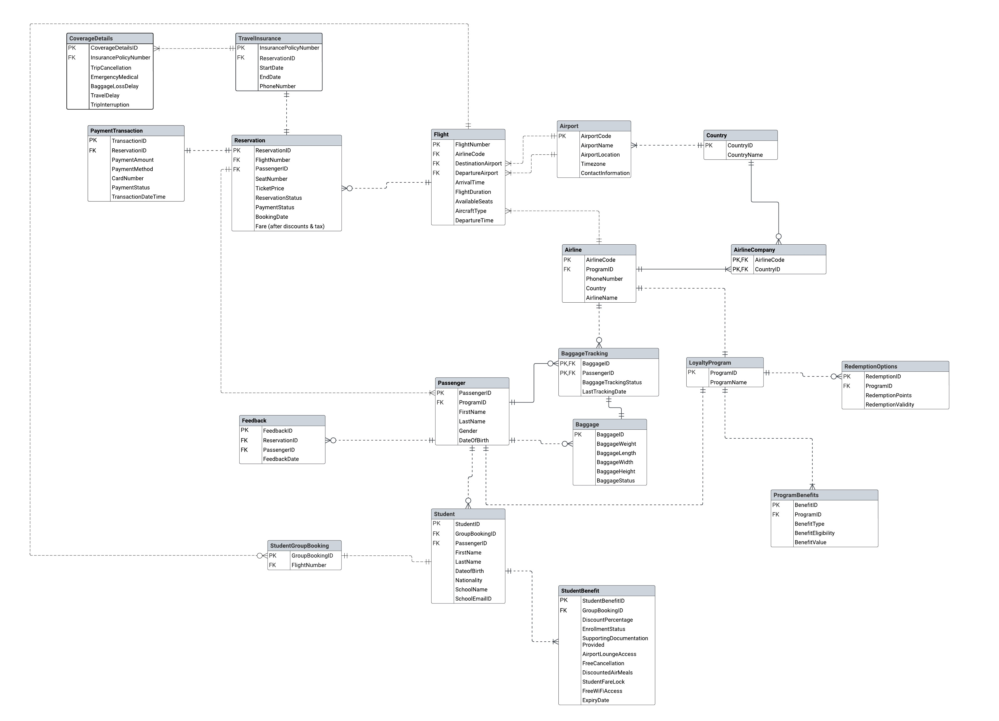

# Airline-Reservation-Management-System

## Database Purpose:

The purpose of developing an Airline Reservation Management System is to create an efficient and centralized platform that automates and streamlines the process of managing airline reservations, ticketing, and related operations. It aims to enhance the overall booking experience for customers, optimize seat utilization, improve data management, and facilitate effective fare management.

## Business Problems Addressed:

1. Student-focused benefits: The system aims to prioritize affordability and accessibility for students. It should offer discounts and benefits tailored to students, ensuring they have access to cost-effective travel options
2. Pricing and Fare Management: The system helps airlines manage fares, discounts, and promotional offers effectively to attract customers while ensuring profitability
3. Paperless Booking Process: The system addresses the challenge of manual reservation processes, eliminating the need for physical ticketing and reducing the dependency on paper-based systems
4. Efficient flight management: The system should optimize the reservation process and streamline operations for airlines and travel agencies. It should enable efficient management of flight details, passenger information, and reservations
5. Customer satisfaction: The system should contribute to customer satisfaction by providing a user-friendly interface, reliable information, and seamless reservation and booking processes

## Business Rules:

1. A Passenger can have zero or more baggage/s
2. A Passenger can give zero or more feedback/s
3. A Passenger may or may not be a student
4. A Student can be part of only one Student Group Booking
5. A Student can have one or many students benefits
6. An Airline will have one or many Flights
7. A Flight can have zero or many Reservations
8. An airport can have one or many Flights
9. A Loyalty program will have one or more program benefits

## Entity Relationship Diagram (ERD):

